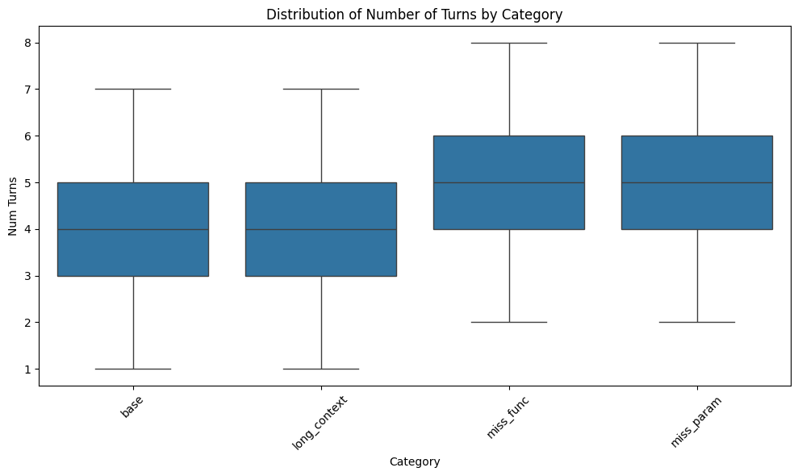

# Dataset Statistics

## Multi-Turn Category Statistics

### Number of turns in each multi-turn category:

| Category     | Min | Max | Median | Mean | Std Dev |
|--------------|-----|-----|--------|------|---------|
| `base`         | 1   | 7   | 4.0    | 3.72 | 1.29    |
| `long_context` | 1   | 7   | 4.0    | 3.72 | 1.29    |
| `miss_func`    | 2   | 8   | 5.0    | 4.72 | 1.29    |
| `miss_param`   | 2   | 8   | 5.0    | 4.72 | 1.29    |

Here is a histogram of the number of turns in multi-turn `base` (note that other multi-turn categories have same distributions shape, and `miss_func` and `miss_param` are shifted to the right by 1 turn due to the additional turn requiring users to have clarification):

### Distribution of tools used in multi-turn `base` category:
Here, we show the histogram of the number of tools used in multi-turn `base` category (note that other multi-turn categories have same distributions, since we "augment" other categories from the `base` entries):

